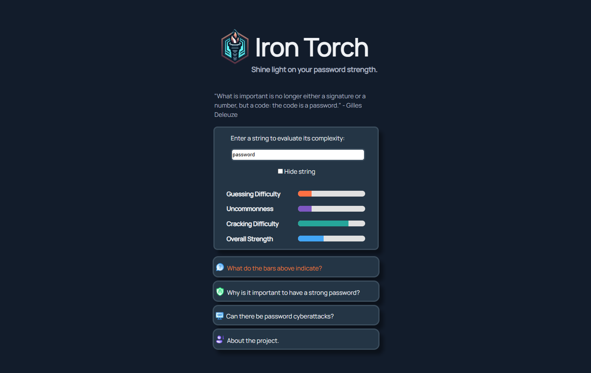

# IronTorch 🔥 : simple password evaluator

**Shine light on your password strength.**  
IronTorch is a small educational tool that evaluates password strength based on length, character diversity and entropy. Built with vanilla HTML, CSS, and JavaScript, it demonstrates
modular code design and secure practices. Developed because AI generated this logo and I liked it, so I wanted to do something with it.

## ✨ Features
- Dynamic bars for **Guessing Difficulty**, **Uncommonness**, **Cracking Difficulty**, and **Overall Strength**.
- Entropy calculation in bits, mapped to a 0–100 scale.
- Randomized quotes for each input.
- Responsive design with custom CSS variables.
- Strings/Passwords are never stored or transmitted.

## 📸 Screenshots



## 🚀 Usage
1. Clone the repository:
```bash
git clone https://github.com/DiodorEos/IronTorch.git
```
2. Open index.html in any modern browser.
3. Type a string in the input field.
4. Bars update dynamically. You can see the strength percentage in browser's console.
5. Toggle visibility (text <-> password) with the checkbox.

## 🛠️ Tech Stack
- HTML5 for structure
- CSS3 with variables and responsive design
- JavaScript (ES6) for logic, entropy calculation, and UI updates

## 📚 Educational Note
IronTorch is a demo project for secure coding and web application design.
Passwords are never stored or transmitted.
